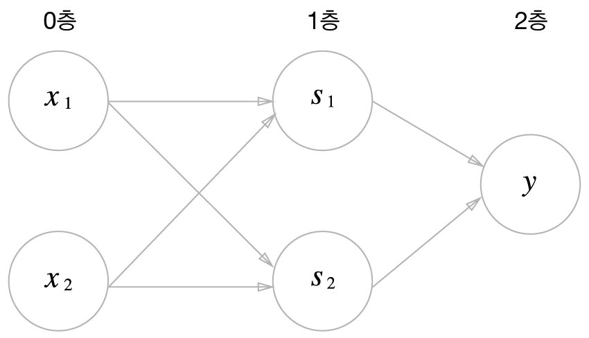

# 💡 CHAPTER 2. 퍼셉트론

### 📌 퍼셉트론 (Perceptron)

- 다수의 신호를 입력으로 받아 하나의 신호로 출력하는 구조
- 신호가 흐름을 만들고 정보를 전달함
- 기본 구조 이미지:
  

---

### ⚙️ 가중치 (Weight)

- 각 뉴런 간 연결의 **중요도**를 나타냄
- **가중치가 클수록** 그 연결은 더 중요한 의미를 가짐
- 모델 학습 == 적절한 가중치를 찾는 과정

---

### 🧭 편향 (Bias)

- 뉴런이 **활성화될 기준값**을 조정하는 역할
- 뉴런이 **특정 값 이상**에서만 활성화되도록 조정
- 기준점을 조절해 **더 유연한 학습**이 가능함
- 원점을 벗어난 다양한 패턴을 학습할 수 있도록 도와줌

---

### 📐 수식 정리

**기본 수식:**

```plaintext
y =
\begin{cases}
 0 (w_1x_1 + w_2x_2 \leq \theta)\\\\
 1 (w_1x_1 + w_2x_2 > \theta)
\end{cases}
```

**편향을 적용한 수식:**

```plaintext
y =
\begin{cases}
 0 (b + w_1x_1 + w_2x_2 \leq 0)\\\\
 1 (b + w_1x_1 + w_2x_2 > 0)
\end{cases}
```

---

### 🧱 다층 퍼셉트론

XOR 게이트의 진리표  
| $x_1$ | $x_2$ | $y$ (XOR) |
|---|---|--------|
| 0 | 0 | 0 |
| 1 | 0 | 1 |
| 0 | 1 | 1 |
| 1 | 1 | 0 |

- XOR 문제는 **선형 분리 불가능**

- 다층 퍼셉트론을 통해 **비선형 분류 가능**
  

- 여기서부터 본격적인 **신경망 개념**이 시작됨

---

## 🔎 요약 정리

- 퍼셉트론은 입출력을 갖춘 간단한 알고리즘이다.
- 입력을 주면 정해진 규칙에 따라 출력한다.
- 가중치와 편향은 퍼셉트론의 핵심 매개변수이다.
- 퍼셉트론은 AND, OR 게이트와 같은 논리 회로를 구현할 수 있다.
- XOR 게이트는 **단층 퍼셉트론으로는 표현 불가능**하다.
- **2층 이상의 퍼셉트론**을 사용하면 XOR도 구현 가능하다.
- 단층 퍼셉트론은 **직선형(선형) 영역**만 표현할 수 있다.
- 다층 퍼셉트론은 **곡선형(비선형) 영역**도 표현 가능하다.
- 다층 퍼셉트론은 이론상 **컴퓨터 수준의 계산도 가능**하다.
